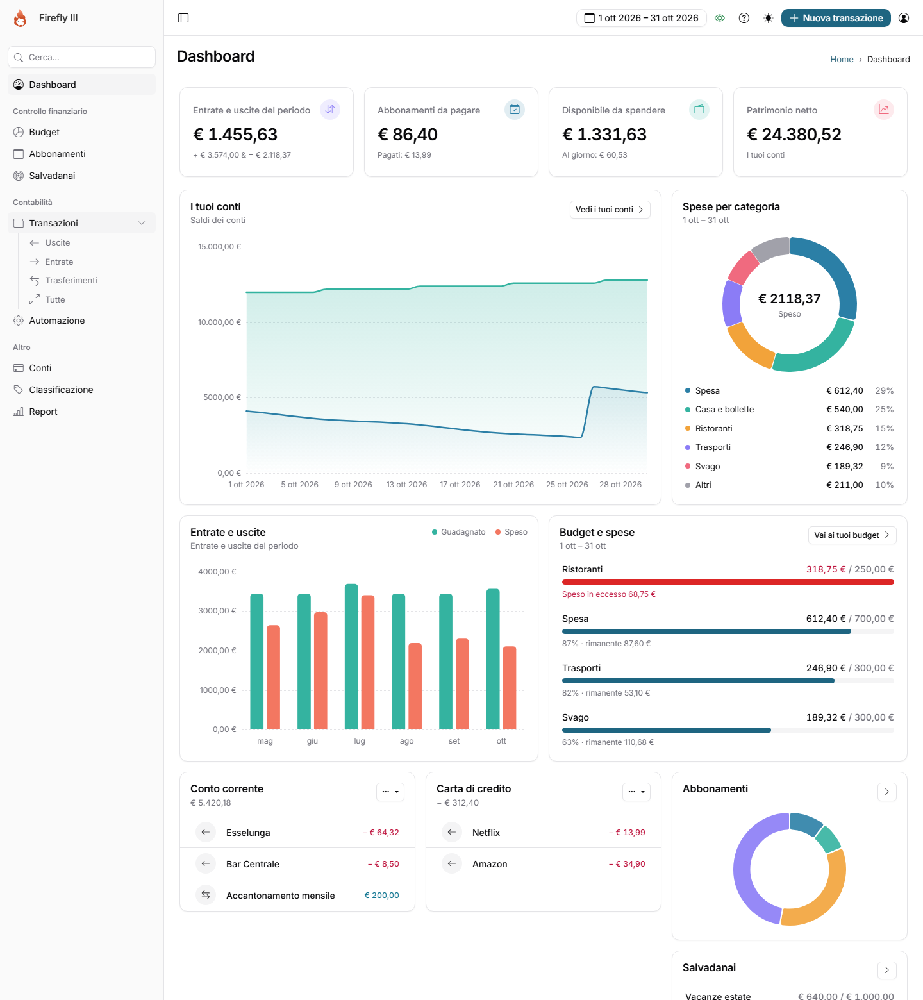
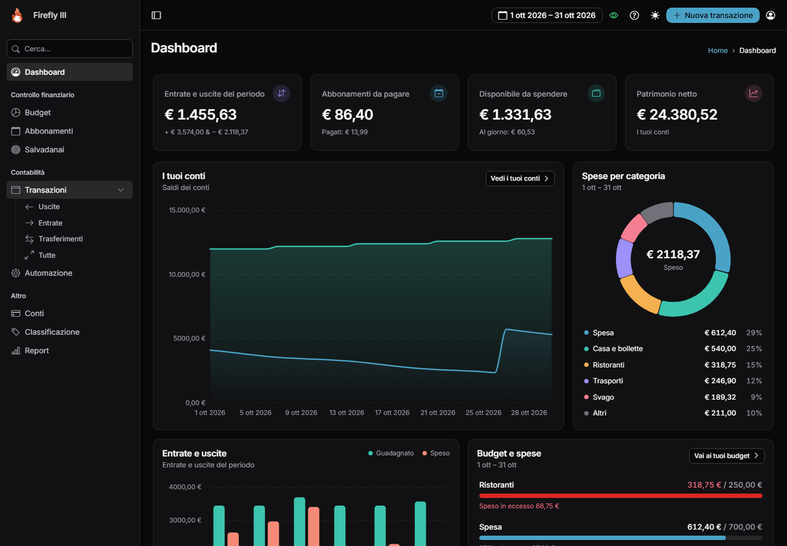
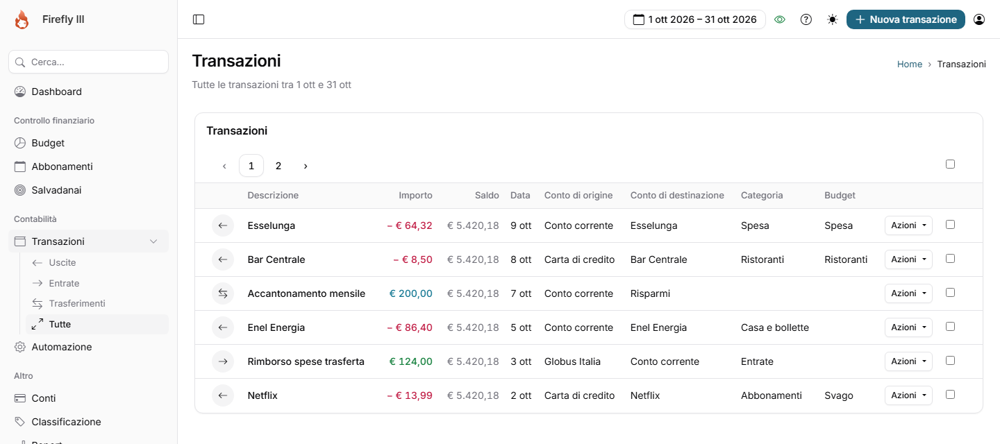
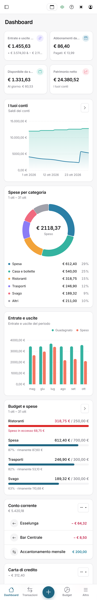
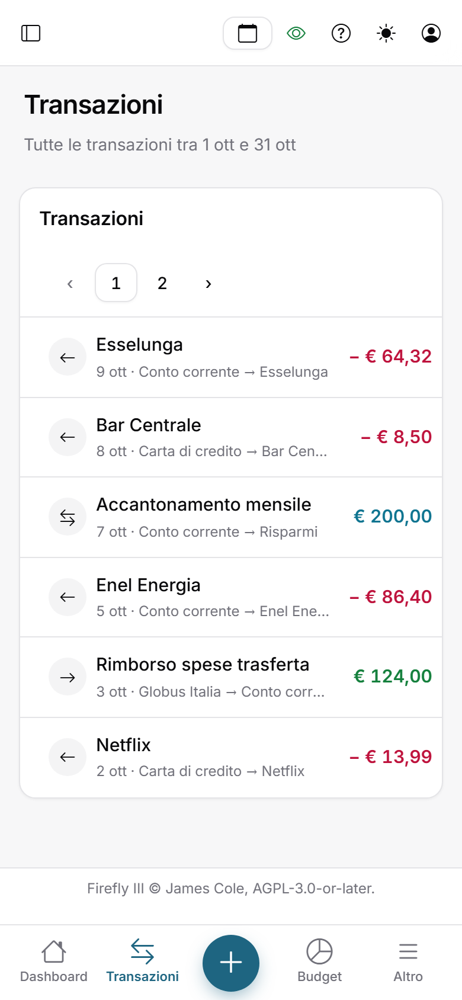
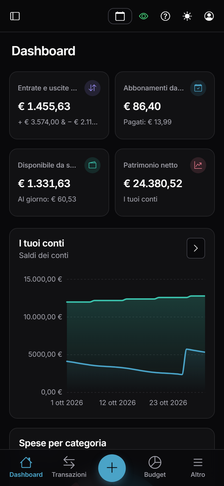

<p align="center">
  <a href="https://firefly-iii.org/">
    
  </a>
</p>
  <h1 align="center">Firefly III</h1>
  <p align="center">
    A free and open source personal finance manager<br>
    No AI, no cloud and privacy-friendly
    <br />
    <a href="https://demo.firefly-iii.org/"><strong>Visit the demo</strong></a>
<br />
<br />
    <a href="https://docs.firefly-iii.org/">Read the docs</a>
    ·
    <a href="https://github.com/firefly-iii/firefly-iii/releases/latest">Download the latest release</a>
    ·
    <a href="https://github.com/firefly-iii/firefly-iii/issues">Submit a bug</a>
    ·
    <a href="https://github.com/firefly-iii/firefly-iii/discussions">Ask a question</a>
    ·
    <a href="https://docs.firefly-iii.org/explanation/more-information/donations/#donations">🙏 Donate</a>
  </p>

> [!NOTE]
> **Questo è un fork personale di [Firefly III](https://github.com/firefly-iii/firefly-iii)** con una nuova interfaccia in stile [shadcn/ui](https://ui.shadcn.com) e un'usabilità migliorata da smartphone.
> Le modifiche sono nel branch [`feature/shadcn-restyle`](https://github.com/StefanoMigotto/my-firefly-iii/tree/feature/shadcn-restyle). Dopo questa sezione trovi il README originale del progetto.

## ✨ Nuova interfaccia: restyle shadcn + mobile

<p align="center">
  
</p>

<table>
  <tr>
    <td width="50%"></td>
    <td width="50%"></td>
  </tr>
  <tr>
    <td align="center"><sub>Dashboard · tema scuro</sub></td>
    <td align="center"><sub>Transazioni · tutte le colonne da tablet in su</sub></td>
  </tr>
</table>

### Da smartphone

<p align="center">
  
  &nbsp;
  
  &nbsp;
  
</p>

<sub>Gli screenshot usano dati di esempio.</sub>

### Cosa cambia

**Stile (shadcn/ui)**
- Nuovi design token per tema chiaro e scuro (palette zinc + blu Firefly `#1e6581`), font **Inter**, bordi sottili, angoli arrotondati e ombre leggere.
- Restyling di pulsanti, card, campi, tabelle, menu a tendina, modali, schede (diventano un controllo a segmenti), badge, paginazione, barre di avanzamento, autocomplete, calendario e tour guidato.
- Menu laterale più pulito con ricerca integrata, header fisso con sfondo sfocato, pagina di login rinnovata.

**Dashboard**
- Card dei numeri chiave con titolo, icona, valore e nota.
- Saldi dei conti con area sfumata e **spese per categoria** in un grafico a ciambella con totale al centro e legenda (importo e percentuale).
- **Entrate e uscite degli ultimi 6 mesi** con barre arrotondate.
- **Budget come barre di avanzamento** (speso / previsto, rimanente, eccesso in rosso).
- Ultime transazioni per conto, abbonamenti e salvadanai.

**Grafici "smooth" in tutto il sito**
- Tutti i grafici usano **Chart.js 4**: le pagine dei conti, dei budget, delle categorie e dei report passano da Chart.js 2.7.
- Curve morbide con area sfumata, punti visibili solo al passaggio del mouse, griglia tratteggiata, tooltip in stile card, barre arrotondate, ciambelle al posto delle torte. Palette unica, anche in tema scuro.

**Usabilità da smartphone**
- **Barra di navigazione in basso** (Dashboard, Transazioni, **+ Nuova**, Budget, Altro) e menu laterale a scomparsa.
- **Liste transazioni a schede**: descrizione, data e conti sotto, importo in evidenza; le colonne secondarie compaiono da tablet in su.
- Campi da 16px (niente zoom automatico su iOS), tastierino decimale per gli importi, aree di tocco più grandi.
- **Pulsante Salva fisso in basso** nel modulo delle transazioni.
- Modali come "bottom sheet", calendario a un mese, numeri chiave in griglia 2×2.

### File principali

| Cosa | Dove |
|---|---|
| Tema (token, componenti, layout, mobile, dashboard) | [`resources/assets/v3/sass/theme/`](https://github.com/StefanoMigotto/my-firefly-iii/tree/feature/shadcn-restyle/resources/assets/v3/sass/theme) |
| Layout, barra in basso, menu laterale | [`resources/views/layout/v3/session.blade.php`](https://github.com/StefanoMigotto/my-firefly-iii/blob/feature/shadcn-restyle/resources/views/layout/v3/session.blade.php), [`resources/views/components/layout/`](https://github.com/StefanoMigotto/my-firefly-iii/tree/feature/shadcn-restyle/resources/views/components/layout) |
| Dashboard | [`resources/views/index.blade.php`](https://github.com/StefanoMigotto/my-firefly-iii/blob/feature/shadcn-restyle/resources/views/index.blade.php), [`resources/assets/v3/js/pages/dashboard/`](https://github.com/StefanoMigotto/my-firefly-iii/tree/feature/shadcn-restyle/resources/assets/v3/js/pages/dashboard) |
| Grafici della dashboard (Chart.js 4) | [`resources/assets/v3/js/shared/draw-chart.js`](https://github.com/StefanoMigotto/my-firefly-iii/blob/feature/shadcn-restyle/resources/assets/v3/js/shared/draw-chart.js) |
| Grafici delle altre pagine (Chart.js 4) | [`public/v1/js/ff/charts.js`](https://github.com/StefanoMigotto/my-firefly-iii/blob/feature/shadcn-restyle/public/v1/js/ff/charts.js), [`public/v1/js/ff/charts.defaults.js`](https://github.com/StefanoMigotto/my-firefly-iii/blob/feature/shadcn-restyle/public/v1/js/ff/charts.defaults.js) |

### Installazione su un'istanza esistente

Il fork si basa su **Firefly III 6.7.7**: usalo su un'installazione della stessa versione.

1. Compila il frontend (serve Node.js):
   ```bash
   cd resources/assets/v3 && npm ci && npm run build
   ```
2. Copia sul server i file modificati e la cartella `public/build`. In alternativa usa l’archivio già pronto [`firefly-restyle.tar.gz`](https://github.com/StefanoMigotto/my-firefly-iii/blob/feature/shadcn-restyle/firefly-restyle.tar.gz) del branch:
   ```bash
   cd /opt/firefly && tar --no-same-owner -xzf /tmp/firefly-restyle.tar.gz
   chown -R www-data:www-data public resources/views app/Support
   php artisan view:clear && php artisan cache:clear
   ```
3. Riavvia il web server e ricarica la pagina con Ctrl+F5.

> [!WARNING]
> Gli aggiornamenti ufficiali di Firefly III sovrascrivono queste modifiche: dopo ogni aggiornamento vanno riapplicate.

---

## Welcome to Firefly III 🥳

"Firefly III" is a (self-hosted) manager for your personal finances. It can help you keep track of your expenses and income, so you can spend less and save more. Firefly III supports the use of budgets, categories and tags. Using a bunch of tools, you can import data. It also has many neat financial reports available.

Firefly III should give you **insight** into and **control** over your finances. Money should be useful, not scary. You should be able to *see* where it is going, to *feel* your expenses and to... wow, I'm going overboard with this aren't I?

But you get the idea: this is your money. These are your expenses. Stop them from controlling you. I built this tool because I started to dislike money. Having money, not having money, paying bills with money, you get the idea. But no more. I want to feel "safe", whatever my balance is. And I hope this tool can help you. I know it helps me.

---

<p>
 Billionaires and fascists are breaking democracies and international alliances. Their profits are costing us our safety. (Digital) sovereignty is more important than ever. <strong>Firefly III</strong> is free open source software and originates from, and lives in the European Union (🇳🇱). Support your local software developer for a free and open society.
</p>

---

[![Packagist][packagist-shield]][packagist-url]
[![License][license-shield]][license-url]
[![Stargazers][stars-shield]][stars-url]
[![Donate][donate-shield]][donate-url]


## Important information

If you don't feel like skipping to the end, here are several ways to run and/or install Firefly III.

- There is a [demo site](https://demo.firefly-iii.org) with an example financial administration already present.
- You can [install it on your server](https://docs.firefly-iii.org/how-to/firefly-iii/installation/self-managed/).
- You can [run it using Docker](https://docs.firefly-iii.org/how-to/firefly-iii/installation/docker/).
- You can [deploy via Kubernetes](https://firefly-iii.github.io/kubernetes/).

Commercial options also exist. First, a sponsored option:

- A one-click installation is available at **[Hostinger](https://www.hostg.xyz/aff_c?offer_id=815&aff_id=243699&url_id=6810)**

If you use any of Hostinger's paid options a small reward is paid to the developer of Firefly III.

Other options are available as well. These are not sponsored, but they do support the development of Firefly III.

- You can [install it using Softaculous](https://www.softaculous.com/softaculous/apps/others/Firefly_III).
- You can [install it using AMPPS](https://www.ampps.com/).
- You can [install it on Cloudron](https://cloudron.io/store/org.fireflyiii.cloudronapp.html).
- You can [install it on Lando](https://gist.github.com/ArtisKrumins/ccb24f31d6d4872b57e7c9343a9d1bf0).
- You can [install it on Yunohost](https://github.com/YunoHost-Apps/firefly-iii).

## Why Firefly III?

Personal financial management is pretty difficult, and everybody has their own approach to it. Some people make budgets, other people limit their cash flow by throwing away their credit cards, others try to increase their current cashflow. There are tons of ways to save and earn money. Firefly III works on the principle that if you know where your money is going, you can stop it from going there.

By keeping track of your expenses and your income you can budget accordingly and save money. Stop living from paycheck to paycheck but give yourself the financial wiggle room you need.

You can read more about the purpose of Firefly III in the [documentation](https://docs.firefly-iii.org/explanation/firefly-iii/about/introduction/).

## Is Firefly III for me?

This application is for people who want to track their finances, keep an eye on their money **without having to upload their financial records to the cloud**. Of course you still can, but you don't have to. It will work for you if you're a bit tech-savvy, you like open source software, and you don't mind tinkering with (self-hosted) servers.

## Sponsors and support

<p align="center">
<a href='https://ko-fi.com/Q5Q5R4SH1' target='_blank'></a>
</p>

Firefly III is a side gig. With your sponsorship or support, I can spend more time on Firefly III. So, if you like Firefly III, and if it helps you save lots of money, why not send me a dime for every dollar saved! 🥳

OK, that was a joke. But for real, when you feel Firefly III made your life better, please consider contributing as a sponsor. Please check out my [Patreon](https://www.patreon.com/jc5) and [GitHub Sponsors](https://github.com/sponsors/JC5) page for more information. You can also [buy me a ☕️ coffee at ko-fi.com](https://ko-fi.com/Q5Q5R4SH1) or send something my way using [Liberapay](https://liberapay.com/JC5). Thank you for your consideration.

### Sponsorships

Firefly III is sponsored by TestMu AI. Their support allows me to test Firefly III more easily and introduce even fewer bugs with every release.

Browser testing via TestMu AI:

<a href="https://www.testmuai.com/?utm_source=fireflyiii&utm_medium=sponsor" target="_blank">

</a>

Firefly III is also sponsored by [Hostinger](https://www.hostg.xyz/aff_c?offer_id=815&aff_id=243699&url_id=6810) with a kickback program that pays me a small amount for every new customer that signs up for their hosting services. Consider using them if you do not want to self-host Firefly III.

## Do you need help, or do you want to get in touch?

Do you want to contact me? You can email me at [james@firefly-iii.org](mailto:james@firefly-iii.org) or get in touch through one of the following support channels:

- [GitHub Discussions](https://github.com/firefly-iii/firefly-iii/discussions/) for questions and support
- [Gitter.im](https://gitter.im/firefly-iii/firefly-iii) for a good chat and a quick answer
- [GitHub Issues](https://github.com/firefly-iii/firefly-iii/issues) for bugs and issues
- <a rel="me" href="https://fosstodon.org/@ff3">Mastodon</a> for news and updates

<!-- END OF HELP TEXT -->

## Features

Firefly III is pretty feature packed. Some important stuff first:

* It is completely self-hosted and isolated, and will never contact external servers until you explicitly tell it to.
* It features a REST JSON API that covers almost every part of Firefly III.

The most exciting features are:

* Create [recurring transactions to manage your money](https://docs.firefly-iii.org/explanation/financial-concepts/recurring/).
* [Rule based transaction handling](https://docs.firefly-iii.org/how-to/firefly-iii/features/rules/) with the ability to create your own rules.

Then the things that make you go "yeah OK, makes sense".

* A [double-entry](https://en.wikipedia.org/wiki/Double-entry_bookkeeping_system) bookkeeping system.
* Save towards a goal using [piggy banks](https://docs.firefly-iii.org/explanation/financial-concepts/piggy-banks/).
* View [income and expense reports](https://docs.firefly-iii.org/how-to/firefly-iii/finances/reports/).

And the things you would hope for but not expect:

* 2 factor authentication for extra security 🔒.
* Supports [any currency you want](https://docs.firefly-iii.org/how-to/firefly-iii/features/currencies/).
* There is a [Docker image](https://docs.firefly-iii.org/how-to/firefly-iii/installation/docker/).

And to organise everything:

* Clear views that should show you how you're doing.
* Easy navigation through your records.
* Lots of charts because we all love them.

Many more features are listed in the [documentation](https://docs.firefly-iii.org/explanation/firefly-iii/about/introduction/).


<!-- END OF SPONSOR TEXT -->

## The Firefly III eco-system

Several users have built pretty awesome stuff around the Firefly III API. [Check out these tools in the documentation](https://docs.firefly-iii.org/references/firefly-iii/third-parties/apps/).

## Contributing

You can contact me at [james@firefly-iii.org](mailto:james@firefly-iii.org), you may open an issue in the [main repository](https://github.com/firefly-iii/firefly-iii) or contact me through [gitter](https://gitter.im/firefly-iii/firefly-iii) and [Mastodon](https://fosstodon.org/@ff3) Of course, there are some [contributing guidelines](https://docs.firefly-iii.org/explanation/support/#contributing-code) and a [code of conduct](https://github.com/firefly-iii/firefly-iii/blob/main/.github/code_of_conduct.md), which I invite you to check out. I can always use your help [squashing bugs](https://docs.firefly-iii.org/explanation/support/), thinking about [new features](https://docs.firefly-iii.org/explanation/support/) or [translating Firefly III](https://docs.firefly-iii.org/how-to/firefly-iii/development/translations/) into other languages. There is also a [security policy](https://github.com/firefly-iii/firefly-iii/security/policy).


## License

This work [is licensed](https://github.com/firefly-iii/firefly-iii/blob/main/LICENSE) under the [GNU Affero General Public License v3](https://www.gnu.org/licenses/agpl-3.0.html).

## Acknowledgements

Over time, [many people have contributed to Firefly III](https://github.com/firefly-iii/firefly-iii/blob/main/THANKS.md). I'm grateful for their support and code contributions.

The Firefly III logo is made by the excellent Cherie Woo.


<!-- 

<p>
 Billionaires and fascists are breaking democracies and international alliances. Their profits are costing us our safety. (Digital) sovereignty is more important than ever. <strong>Firefly III</strong> is free open source software and originates from, and lives in the European Union (🇳🇱). Support your local software developer for a free and open society.
</p>

<p align="center">
	
</p>


<p align="center">
  
</p>


-->

<!-- HELP TEXT -->

[packagist-shield]: https://img.shields.io/packagist/v/grumpydictator/firefly-iii.svg?style=flat-square
[packagist-url]: https://packagist.org/packages/grumpydictator/firefly-iii
[license-shield]: https://img.shields.io/github/license/firefly-iii/firefly-iii.svg?style=flat-square
[license-url]: https://www.gnu.org/licenses/agpl-3.0.html
[stars-shield]: https://img.shields.io/github/stars/firefly-iii/firefly-iii.svg?style=flat-square
[stars-url]: https://github.com/firefly-iii/firefly-iii/stargazers
[donate-shield]: https://img.shields.io/badge/donate-%24%20%E2%82%AC-brightgreen?style=flat-square
[donate-url]: #support-the-development-of-firefly-iii
[build-shield]: https://api.travis-ci.com/firefly-iii/firefly-iii.svg?branch=master
[build-url]: https://travis-ci.com/github/firefly-iii/firefly-iii
[sc-gate-shield]: https://sonarcloud.io/api/project_badges/measure?project=firefly-iii_firefly-iii&metric=alert_status
[sc-bugs-shield]: https://sonarcloud.io/api/project_badges/measure?project=firefly-iii_firefly-iii&metric=bugs
[sc-smells-shield]: https://sonarcloud.io/api/project_badges/measure?project=firefly-iii_firefly-iii&metric=code_smells
[sc-vuln-shield]: https://sonarcloud.io/api/project_badges/measure?project=firefly-iii_firefly-iii&metric=vulnerabilities
[sc-project-url]: https://sonarcloud.io/dashboard?id=firefly-iii_firefly-iii
[bp-badge]: https://bestpractices.coreinfrastructure.org/projects/6335/badge
[bp-url]: https://bestpractices.coreinfrastructure.org/projects/6335

A final note: This readme was written entirely without the use of LLMs or other artificial text generators. All spelling errors and other mistakes are therefor my own fault.
